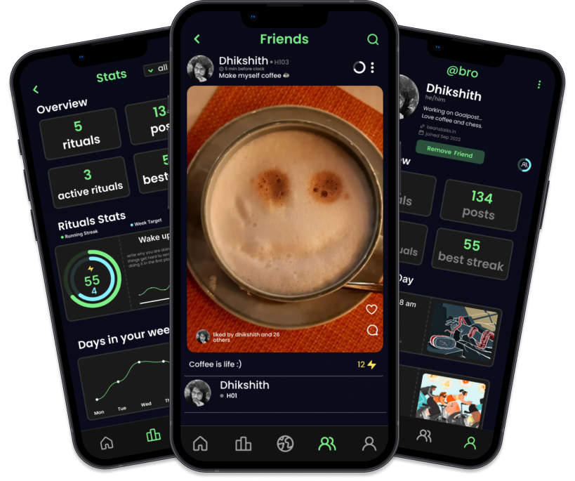

    

<h1 align="center">Folksable - Your Ultimate Habit-Tracking App with Social Accountability</h1>

    An Unobtrusive Social Platform To Compound Your Habits.

    

## 🌟 Features

- **Social Contracts:** Make social contracts with your friends to pursue your rituals, habits and goals.
- **Invite Friends:** Invite your friends to join your rituals or join theirs to have each other on the journey.
- **Engagement:** Designed to keep you and your ritual members engaged and feel like a multiplayer video game.

## 🚀 Getting Started

1. Download Folksable from the App Store or Google Play Store.
2. Sign up and start creating your habits.
3. Invite your friends and start tracking together!

## 🛠 Features Breakdown

- **Social Contracts:** Seal the deal with your friends. Make a social contract and hold each other accountable.
- **Privacy Controls:** Share what you want, keep the rest private.
- **Streaks:** Keep the momentum going. Track your progress and keep the streaks.
- **Rewards:** Treat yourself. Set rewards for hitting certain milestones.
- **Rituals:** Create custom habits with friends.
- **Tasks:** Break down your goals into smaller, manageable tasks.

## 🔒 Privacy

Your privacy is our priority. Your data is securely stored and encrypted, and you only share what you want to share with your friends.

## 📣 Join the Folksable Community Today

Ready to change your habits for the better? Join the Folksable community today and start tracking your habits with the power of social accountability. Say goodbye to boring habit tracking and hello to a fun, social way to improve your life.

## 🎉 Conclusion

Folksable is perfect for anyone who wants to make positive changes in their life with the help of their friends. The app is designed to be unobtrusive and easy to use, so you can focus on building healthy habits. Download Folksable today and start compounding your habits with the power of social accountability.